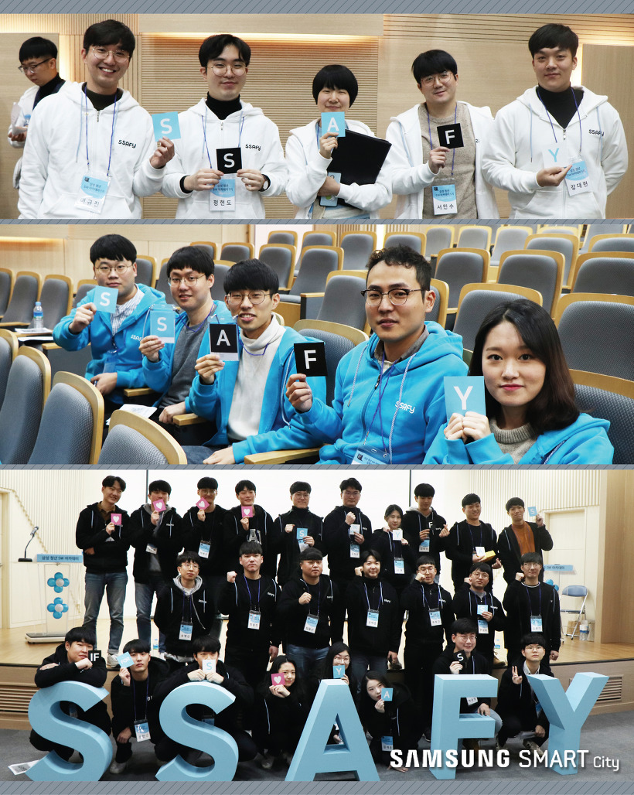

# WEB

WWW: 인터넷이 연결된 / 컴퓨터들을 통해/ 사람들이 정보를 공유할 수있는 전 세계적인 정보공간을 말한다. (간단히 WEB)

컴퓨터와 컴퓨터 사이에 정보를 공유하는 공간: Web


### Web Service

월드 와이드 웹, 인터넷 상에서 두 객체(클라이언트와 서버) 간 요청과 응답으로 작업 처리를 하도록 구성된 서비스라고 정의 할 수 있다.(두 객체간 요청과 응답의 상호작용을 하게 해주는 서비스)

일반적으로 클라이언트와 서버는 多: 1 구조이므로,  다수의 서버를 보유해야 하며, 이를 서버 컴퓨터라고 함.

> [현실]
>
> A: XXX를 주세요(요청)  /  B: 넵 (응답)
>
> A: XXX를 처리해주세요(요청) /  B: 넵(응답)
>
> [WEB]
>
> A: 요청(Request)하는 컴퓨터(고객, Client)  
>
> B: 해주는(응답: Response) 컴퓨터(서버, Server) 


### Web browser

월드 와이드 웹에서 모든 정보를 볼 수 있도록 해주는응용 프로그램임.

웹상에서 요청을 보내기 위해서는 브라우저가 필요함 (익스플로러, 사파리, 크롬, 파이어 폭스 등)

우리(Browser를 쓰는 사람; 유저)는 브라우져를 통해 요청을 보냄


요청의 종류

1. 줘라(Get) 

   예) HTML 문서를 요청하고, 문서를 서버로 부터 받음.

2. 받아라(Post)

   예) 어떠한 정보를 서버에 전달(Post)하고, 서버를 부가적인 작업을함 \

   (데이터베이스에 저장하는 등..)


요청: 실제로 컴퓨터를 쓰고 있는 사람(브라우저를 쓰고 있는 사람); 유저

응답: 서버에서 동작하고 있는 프로그램


웹서비스를 만든다? 서버컴퓨터에서 요청과 응답을 처리할 프로그램을 개발한다.


### Static Web

Static Web : 정말 단순한 웹 서비스

이문서를 주세요 라고 요청하면, 어떠한 변형, 연산등도 없이,  단순히 문서를 보냄(응답)

서버의 파일이 도서관의 책처럼 적재되어 있고 클라이언트의 요청을 통해서해당 파일을 마치 책을 보는 것처럼 꺼 내 올 수만 있는 웹 서비스.


크롬이 문서를 보내는방식: `/dir1/dir2/../WantThis.file`

파일 & 폴더의 경로를 통해서 브라우져에서 파일을 열 수 있음.


남의컴퓨터에서 파일을 여는 경우? `남의 컴퓨터 주소/dir1/dir2/../WantThis.file  `가 될 것이며,

이때 남의컴퓨터 주소란 IP 주소를 의미한다.  (예. 172.217.27.78; 구글의 실제 주소)


학교: 대구 북구 산격동 대학로 80 

주소만 보면 어떠한 것인지 알 수 없음. 따라서 우리는 경북대학교 라고 이름을 명명함.

여기서 주소는 IP주소, 경북대학교는 웹 사이트 주소 라고 할 수 있음.

IP 주소: 172.217.27.78

웹 사이트 주소: google.com


### Dynamic Web

Dynamic Web (Web Application Program; Web APP)  예) Flask

Static Web과 상반되는 개념.

동적으로파일을 생성하여 뿌려주는 Web.  (예: http(s)://hphk/lectures/1)


웹브라우져에서 서버컴퓨터에 무언가를 달라고 요청(Get)하는 방법?

URI: 상위개념/ URL

URL: 네트워크 상에서 자원이 어디에 있는지를 알려주기 위한 고유 규약

흔히 웹 사이트 주소로 알고 있지만, URL은 웹 사이트 주소 뿐만 컴퓨터 네트워크 상의 자원을 모두 나타 낼수 있음


# HTML

HTML(Hyper Text Markup Language) : 웹페이지를 작성하기 위한 역할 표시 언어 

(프로그래밍 언어는아님)

- Hyper Text:  

  기존의 텍스트는 정해진 순서(선형적)대로 이동을 해야 했음.

  그러나 Hyper Text는 링크를 이용하여 이곳 저곳으로 텍스트를 옮겨 다닐 수 있게 됨.

  HTTP(S): Hyper Text Transfer Protocol의 약자로, 인터넷에서 정보를 주고 받는 통신 규약

- Markup: 

  제목, 본문의 내용 등을 보기 좋게 태그로 묶고, 역할에 따라 다른 태그를 적용함


## HTML의 기본구조

```HTML
<!DOCTYPE html> 
<html lang="en">
<head>
    <meta charset="UTF-8">
    <meta name="viewport" content="width=device-width, initial-scale=1.0">
    <meta http-equiv="X-UA-Compatible" content="ie=edge">
    <title>Document</title>
</head>
<body>
    
</body>
</html>
```

- `<!DOCTYPE html> ` : doc type 의 선언부

- HTML 요소: HTML 문서의 최상위 요소로 문서의 root를 뜻한다. head와 body로 구분된다.

  -  head 요소: 문서 제목, 문자코드(인코딩)와 같이 해당 문서 정보를 담고 있으며, 브라우저에 나타나지 않는다.​

    CSS선언 혹은 외부 로딩 파일 지정 등을 작성합니다.

  - body 요소: 브라우저 화면에 나타나는 정보로 실제 내용에 해당한다.


## Tag와 DOM TREE (Document Object Model)

### 요소(Element)

HTML의 element는 태그와 내용(contents)로 구성되어 있다.

```python
<h1>웹문서</h1>
# <h1>: (여는/시작) 태그
# <h1>: (닫는/종료) 태그
```

- 태그는 대소문자를 구별하지 않으나, 소문자로 작성하는 것을 권장한다. (as per W3C)
- 요소간 중첩도 가능하다.

### Self-closing element

닫는태그가 없는 태그도 존재한다.

``

### 속성(Attribute)

태그에는 속성이 지정될 수 있다.

```python
<a href="https://google.com"/>
# href: 속성명
# google.com: 속성 값
```

- id, class, style 속성은 태그와 상관 없이 모두 사용 가능하다. (Global Attribute)
- 띄워쓰기를 쓰지 않으며 속성명= 이하의 경우는 큰따옴표를 쓰는 것이 일반적인 약속이다.

### Dom 트리

태그는 주첩되어 사용가능하며, 이때 다음과 같은 관계를 갖는다.

```html
<body>
  <h1>웹문서</h1>  
  <ul>
      <li>HTML</li>
      <li>CSS</li>
    </ul>
</body>
```

- body 태그와 h1태그는 부모(parent) - 자식(child) 관계
- li 태그는 형제(sibling) 관계
- h1 ul 태그는 형제(sibling) 관계


### 시맨틱 태그

태그 자체가 의미를 가질 때 시맨틱 태그라고함.

컨텐츠의 의미를 설명하는 태그로서, HTML5에 새롭게 추가된 시맨틱 태그가 있다.

사용 이유?

- header: 헤더(문서 전체나 섹션의 헤더)
- nav: 내비게이션
- aside: 사이드에 위치한 공간으로 메인 콘텐츠와 관련성이 적은 콘텐츠에 사용
- section: 문서의 일반적인 구분으로 컨텐츠의 그룹을 표현하며, 일반적으로 h1-h6요소를 가짐
- article: 문서, 페이지, 사이트 안에서 독립적으로 구분되는 영억(포럼/신문 등의 글 또는 기사)
- footer: 푸터(문서 전체나 섹션의 푸터)


개발자 및 사용자 뿐만 아니라 검색엔진 등에 의미있는 정보의 그룹을태그로 표현하여 단순히 보여주기 위한 것을 넘어서 의미를 가지는 태그들을 활용하기 위한 노력

non sementic  요소: div, span 등


구글 확장 프로그램: Web Developer ->  information -> View Document Outline을 보면, 특정 사이트가 어떻게 시멘트 태그를 사용하지는 지 확인 할 수 있다.


### 대표적인 HTML의 Tag (1)

- 제목 / 굵게 / 기울임 / 강조 / 취소선  / 밑줄 / 아래첨자 / 윗 첨자 /

  문단 구분 / 줄 구분 /  그대로 입력 / 구분선 / 인용 / 리스트 

```html
<body>
    <!-- head: 제목 -->
    <h1>Hi, There!</h1>
    <h2>Hi, There!</h2>
    <h3>Hi, There!</h3>
    <h4>Hi, There!</h4>
    <h5>Hi, There!</h5>
    <h6>Hi, There!</h6>

    <!-- Bold: 굵게 -->
    <b>This is bold</b>      
    <strong>This is strong(semenatic)</strong>

    <!-- italic: 기울임 -->
    <i>This is italic</i>
    <em>This is em.(sementic)</em>   <!-- emphasized -->

    <!-- highlighted: 강조 -->
    <h2>이건 하이라이트 <mark>마크됐나?</mark> </h2>

    <!-- del: 취소선 / ins: 밑줄 -->
    <h2>이건 <del>del</del>.</h2>
    <h2>이건 <ins>ins</ins>.</h2>

    <!-- sub: 아래 첨자 / sup: 윗 첨자 -->
    <h2>이건 <sub>sub</sub>.</h2>
    <h2>이건 <sup>sup</sup>.</h2>

    <!-- p: 문단 구분 / br: 줄 구분 -->
    <p>이건 p tag에 br넣은기고.<br>
            이건 p tag.이건 p tag.
            이건 p tag.이건 p tag.이건 p tag.
            이건 p tag.이건 p tag.이건 p tag.이건 p tag.
    </p>    
    
    <!-- pre -->
    <pre>
        from flask import Flask
        app = Flask(__name__)

        @app.route('/')
    </pre>

    <!-- hr: 구분선 생성 -->
    <hr>

    <!-- q: quote(인용) / blockquote -->
    <p>
        Junwoo said, <q>Hello World</q>
    </p>
    <blockquote>
        Hello world!
    </blockquote>

    <!-- li: 리스트 작성 -->
    <!-- ol 또는 ul을 쓴 이후, li를 작성 요 -->
    <ol>
        <li>first</li>
        <li>second</li>
        <li>third</li>
    </ol>

    <ul>
        <li>first</li>
        <li>second</li>
        <li>third</li>
    </ul>

</body>
```


### 대표적인 HTML의 Tag (2)

- 링크 / 이미지 / 동영상 / 동영상 링크

```html
<section id="link">		
<!-- a(anchor): 정박하다. 링크 등과 연동되는 태그
    href.values
   	 1. 절대 URL 예) google.com
     2. 상대 URL
     3. element id 
		예) #python 등과 같이 입력 후 이동하고자 하는 태그에 
			id="python" 처럼 입력,
     4. mailto:
    
	target
     1. target="_self" - 현재 탭에서 실행
     2. target="_blank" - 새로운 탭에서 실행 -->
    
	<a href="https://www.google.com" target="_self">
        절대 URL</a>
    <a href="index.htm" target="_blank">상대 URL</a>
    <a href="#python">파이썬으로(id python)</a>
    <a href="mailto:nowater.in.the.house@gmail.com">메일보내기		</a>
</section>

<!-- Bullet의 모양 변경: 
	none, square, circle, lower-alpha, 
	upper-alpha, upper-roman -->

	<ul style="list-style-type: circle;">
    	<li>HTML</li>
    	<li>CSS</li>
	</ul>

<!-- img: 이미지 등록
	1. src: 이미지 파일에 대한 경로
	2. alt: 이미지 파일에 대한 설명
	3. width & height: 이미지 파일 너비 & 높이 -->
	

	<video src="video.mp4" width="300px" height="" controls>	</video>

<!-- iframe: 동영상 링크 연결 -->
	<iframe width="560" height="315" src="주소" 				frameborder="0">
	</iframe>

```


### 대표적인 HTML의 Tag (3)

- 표 만들기, 입력창, 목록상자, 체크박스,  선택박스

```html
<section>
    <!-- table -->
    <table>
        <!-- table row -->
        <tr>
            <!-- table head -->
            <th></th>
            <th>월</th>
            <th>화</th>
            <th>수</th>
        </tr>
        <tr>
            <!-- table data -->
            <td>A 코스</td>
            <!-- rowspan : 세로 칸 늘리기 -->                
            <td rowspan="2">짬뽕</td>
            <!-- colspan : 가로 칸 늘리기 -->
            <td colspan="2">초밥</td>

        </tr>
        <tr>
            <td>B 코스</td>
            <td>김치찌개</td>
            <td>삼계탕</td>   
        </tr>
    </table>
</section>

<section>
<!-- form: 입력창 태그 -->
<form action="" method="GET">
    <input type="text"><br>
    <input type="password"><br>
    <input type="number" min="15" max="30" step="5"><br>

    <!-- radio: 선택박스 -->
    <div>
        <input type="radio" name="sandwich">에그 마요<br>
        <input type="radio" name="sandwich">비엠티<br>
        <input type="radio" name="sandwich">터키 베이컨<br>
    </div>

    <!-- checkbox: 체크박스 -->
    <div>
        <input type="checkbox" name="topping">토마토<br>
        <input type="checkbox" name="topping">오이<br>
        <input type="checkbox" name="topping">할라피뇨<br>
        <input type="checkbox" name="topping">핫 칠리<br>
        <input type="checkbox" name="topping">바베큐 소스<br>
    </div>

    <!-- select: 목록상자 -->
    <div>
        <select name="" id="">
            <option>허니오트밀</option>
            <option disabled>플랫브레드</option>
            <option selected>파마산 오레가노</option>
        </select>
    </div>

    <input type="submit" value="로그인">
</form>
```

AA


