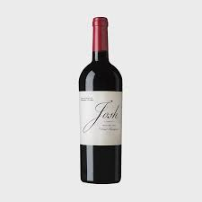

# CSS Framework

---

# Bootstrap

---

### CDN (content delivery network) 

* 컨텐츠를 효율적로 전달하기 위해 여러 노드에 가진 네트워크에 데이터를 제공하는 시스템

* CND을 통해  bootstrap에 작성된 CSS, JS를 활용한다. 

* CDN의 장점

  * 개별 end-user의 가까운 서버를 통해 빠르게 전달 가능
  *  외부 서버를 활용함으로써 본인 서버의 부하가 적어짐

  * CDN은 보통 적절한 수준의 캐시 설정으로 빠르게 로딩할 수 있음


### Bootstrap 사이트

* https://getbootstrap.com/ 
  * 공식사이트
* https://bootstrapcreative.com/resources/bootstrap-4-css-classes-index/
  * Bootstrap Classes List

* 코드 정리 `alt + shift + f `

### Bootstrap start

* HTML에 bootstrap을 적용하기 위해
  getbootstrap.com/ 의  Quick start의 몇 가지 코드를 html에 붙여 넣는다

* 닫는 head 직전에 추가

  * ```html
    <link rel="stylesheet" href="https://stackpath.bootstrapcdn.com/bootstrap/4.2.1/css/bootstrap.min.css" integrity="sha384-GJzZqFGwb1QTTN6wy59ffF1BuGJpLSa9DkKMp0DgiMDm4iYMj70gZWKYbI706tWS" crossorigin="anonymous">
    ```

* 닫는 body 직전에 추가

  ```html
  <script src="https://code.jquery.com/jquery-3.3.1.slim.min.js" integrity="sha384-q8i/X+965DzO0rT7abK41JStQIAqVgRVzpbzo5smXKp4YfRvH+8abtTE1Pi6jizo" crossorigin="anonymous"></script>
      <script src="https://cdnjs.cloudflare.com/ajax/libs/popper.js/1.14.6/umd/popper.min.js" integrity="sha384-wHAiFfRlMFy6i5SRaxvfOCifBUQy1xHdJ/yoi7FRNXMRBu5WHdZYu1hA6ZOblgut" crossorigin="anonymous"></script>
      <script src="https://stackpath.bootstrapcdn.com/bootstrap/4.2.1/js/bootstrap.min.js" integrity="sha384-B0UglyR+jN6CkvvICOB2joaf5I4l3gm9GU6Hc1og6Ls7i6U/mkkaduKaBhlAXv9k" crossorigin="anonymous"></script>
  ```


### bootstrap spacing

* 클래스로 해당 영역에 margin과 padding 값을 적용한다.
* class="[m, p]   [t, b, l, r, x, y]  ["-"]  [0, 1, 2, 3, 4, 5, auto] "
* [마진,패딩] [방향(없으면 전방위)] ["-"] [지정된 숫자에 맞게 size가 정해짐]
* 사용 예시 

````html
<h1 class="p-3 m-0">Get Bootstrap!</h1>
````

* https://getbootstrap.com/docs/4.2/utilities/spacing/

  

### bootstrap Color

##### background color

해당 영역의 컨텐츠의 배경에 색을 적용한다.


* 사용 예시

```html
<h1 class="p-3 m-0 bg-primary ">Get Bootstrap!</h1>
```

##### text color

class로 해당 영역의 텍스트에 색을 적용한다.


```html
<h2 class="text-success alert-warning ">Nice to meet you.</h2>
```


##### border

* 해당 영역의 border에 add, remove, color, radius  속성을 적용한다.

* border rounded-pill: border의 양쪽 끝을 둥글게 만든다.
* 사용 예시

```html
<h1 class="border border-success border rounded-pill ">Get Bootstrap!</h1>
```

* * border에 색상과 가장자리 속성을 적용


##### Display

.d-none : 다 숨김

.d-inline : 글자크기에 맞춰 보여줌

.d-inline-block : 

.d-block : 해당 영역 전체에 다 보여줌


##### Position

* fixed

```html
<h1 class="p-3 bg-primary position-fixed fixed-bottom">Get Bootstrap!</h1>
```

글씨가 현재 화면에 고정된다.  그 위치에 다른 글이나 이미지가 있으면 fixed 컨텐츠로 덮어진다.

##### Font

* class="text-center"
  * 가운데 정렬
* class="font-weight-bold"
  * 글씨 굵게

* class="font-italic"
  * 이탤릭체


### Layout

* Container 
  * bootstrap의 기본적인 레이아웃 요소(가운데 표시 되는 기본 틀) 이고 grid 시스템을 사용할 때 필요하다.

```html
<div class="container"> </div>
```

"div.container" + "tap" : `<div class=container"></div>` 자동생성

 

#### Grid

##### 12 greed system

* row안에 col로 구분해서 컨텐츠를 배치한다.

* 화면(layout)을 col 12개로 나눠서 사용한다.
  * 12는 약수가 제일 많아서 같은 사이즈로 많이 나눌수 있다.


```html
<div class="col-4 col-sm-3 col-md-2 border border-success">1</div>
```

* container width가 720px 이상이면 column은 6등분
* container width가 579px 이상이면 column은 4등분
* container width가 576px 이하면 column은 3등분

```html
<div class="offset-4 col-3 border border-primary">
                One of three columns col -3
```

* 4 만큼 offset으로 공백을 가지고 3을 boder로 가진다.

### Components

* #### Alers

  * 텍스트에 상황별 색깔 나타냄

  ```html
  <div class="alert alert-primary" role="alert">
    A simple primary alert—check it out!
  </div>
  ```

  

* ####  Badge

  * 라벨링

  ```html
  <h1>Example heading <span class="badge badge-secondary">New</span></h1>
  ```

  

* ####  Buttons

  * Bootstrap’s custom button styles

  ```html
  <button type="button" class="btn btn-outline-danger btn-lg btn-block" disabled>Danger</button>
  ```

  

  * <"btn [버튼 색깔 채우기/말기] [버튼 크기] [버튼범위]" [클릭 가능/불가능]>

* #### Button group

  * 연속된 버튼 그룹

  ```html
  <div class="btn-group" role="group" aria-label="Basic example">
    <button type="button" class="btn btn-secondary">Left</button>
    <button type="button" class="btn btn-secondary">Middle</button>
    <button type="button" class="btn btn-secondary">Right</button>
  </div>
  ```

  * < "[bnt-group] [버튼 크기] [버튼 나열 방향]" .. >

* #### Card

  * 간단한 contents를 넣을 수 있는 컨테이너 

  ```html
  <div class="container">
              <div class="row">
                  <div class="col-4">
                      <div class="card">
                          
                          <div class="card-body">
                              <h5 class="card-title">Card title</h5>
                              <p class="card-text">Some quick example text to build on the card title and make up the
                                  bulk of the card's content.</p>
                              <a href="#" class="btn btn-primary">Go somewhere</a>
                          </div>
                      </div>
                  </div>
              </div>
          </div>
  ```

  

* #### Carousel

  * 이미지 슬라이드쇼 

```html
<div class="container">
            <div id="carouselExampleIndicators" class="carousel slide" data-ride="carousel">
                <ol class="carousel-indicators">
                    <li data-target="#carouselExampleIndicators" data-slide-to="0" class="active"></li>
                    <li data-target="#carouselExampleIndicators" data-slide-to="1"></li>
                    <li data-target="#carouselExampleIndicators" data-slide-to="2"></li>
                </ol>
                <div class="carousel-inner">
                    <div class="carousel-item active">
                        
                    </div>
                    <div class="carousel-item">
                        
                    </div>
                    <div class="carousel-item">
                        
                    </div>
                </div>
                <a class="carousel-control-prev" href="#carouselExampleIndicators" role="button" data-slide="prev">
                    <span class="carousel-control-prev-icon" aria-hidden="true"></span>
                    <span class="sr-only">Previous</span>
                </a>
                <a class="carousel-control-next" href="#carouselExampleIndicators" role="button" data-slide="next">
                    <span class="carousel-control-next-icon" aria-hidden="true"></span>
                    <span class="sr-only">Next</span>
                </a>
            </div>
        </div>
```

* #### Collapse

  * 클릭 토글로 컨텐츠 나타나기/숨기 하는 기능

```html
<div class="container">
            <p>
                <a class="btn btn-primary" data-toggle="collapse" href="#collapseExample" role="button" aria-expanded="false"
                    aria-controls="collapseExample">
                    Link with href
                </a>
                <button class="btn btn-primary" type="button" data-toggle="collapse" data-target="#collapseExample"
                    aria-expanded="false" aria-controls="collapseExample">
                    Button with data-target
                </button>
            </p>
            <div class="collapse" id="collapseExample">
                <div class="card card-body">
                    Anim pariatur cliche reprehenderit, enim eiusmod high life accusamus terry richardson ad squid.
                    Nihil anim keffiyeh helvetica, craft beer labore wes anderson cred nesciunt sapiente ea proident.
                </div>
            </div>
        </div>
```

* #### Forms

  * 아이디, 패스워드 입력 등 form style

```html
<div class="container">
            <form>
                <div class="form-group">
                    <label for="exampleInputEmail1">Email address</label>
                    <input type="email" class="form-control" id="exampleInputEmail1" aria-describedby="emailHelp"
                        placeholder="Enter email">
                    <small id="emailHelp" class="form-text text-muted">We'll never share your email with anyone else.</small>
                </div>
                <div class="form-group">
                    <label for="exampleInputPassword1">Password</label>
                    <input type="password" class="form-control" id="exampleInputPassword1" placeholder="Password">
                </div>
                <div class="form-group form-check">
                    <input type="checkbox" class="form-check-input" id="exampleCheck1">
                    <label class="form-check-label" for="exampleCheck1">Check me out</label>
                </div>
                <button type="submit" class="btn btn-primary">Submit</button>
            </form>
            <!-- input Group
            Input들의 묶음 예)button + input tag -->
        </div>
```

* #### Media object

* #### Modal

* #### Progress

* #### Spinners

* #### Navbar

* #### Pagination

  

  