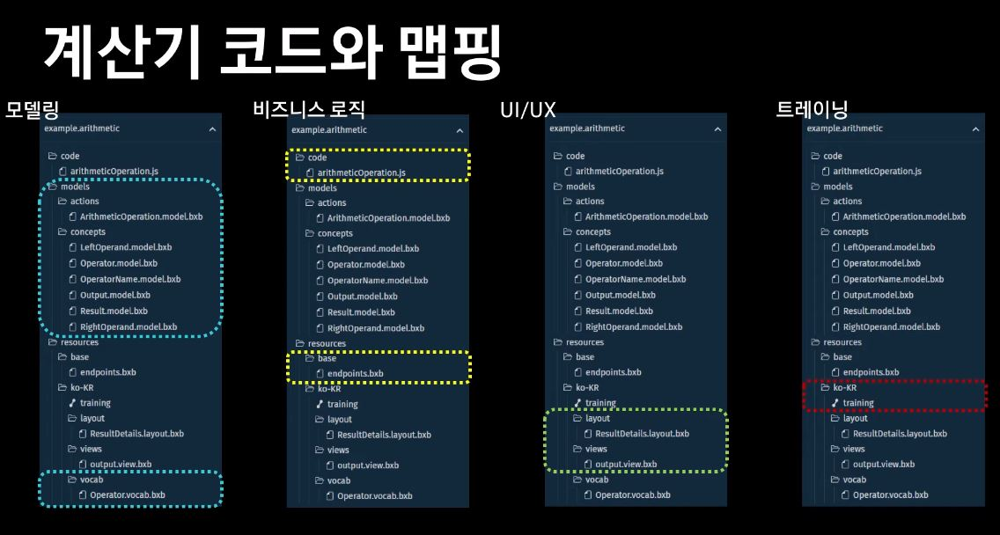

# 190529

### 음성 인식과 자연어 이해

	* 음성인식(ASR: Automatic Speech Recognition): 발화를 문자로 변환하는 기술
* 자연어(NLU: Natural Language Understanding): 문장의 의미를 이해는 기술

### Bixby 서비스 아키텍처

* 1번 - 음성파일 빅스비 서버에 전달 
* 2번- 음성을 문자로 변환
* 3번- 의도 파악하고 필요한 캡슐을 찾는다
* Plan- 할 일에 대한 순서도(capsule 코드를 바탕으로 재구성)
* Capsule을 잘 만들어야 Capsule이 잘 분류 된다

### Capsule 구조

* 1 모델링

  * concepts: 발화 인식 및 발화 결과를 리턴할 때 필요한 값
  * Actions: 캡슐이 사용자가 원하는 작업을 이해하도록 수행할 동작을 정의

  

* 2 비지니스 로직

  *  사용자가 원하는 작업을 실제 수행하는 코드
  * 이 단계에서 서비스 API를 연동

  

* UI/UX

  * 최종 결과를 사용자에게 보여주는 레이아웃 작업
  * Dialog: 사용자에게 되묻거나 결과를 응답해주는 응답문 생성

  

* 트레이닝

  *  Capsule이 잘 동작하도록, 처리할 수있는 발화를 생성하고 자연어 트레이닝을 진행
  * Debbuging: 개발한 캡슐이 잘 동작 하는지 확인

 

### Bixby Capsule 기본 개념

#### 01 Modeling

​	input과 output을 concept이라하고 input concept을 가지고       	output concept을 도출하는 동작이 action

##### concept의 종류

##### action

### 02 Business Logic (실제 동작)

`.bxb`파일에 작성

#### 03 Training

사용자의 발화를 빅스비에게 학습시키는 것 

#### 04 Views

결과를 보여 주는 방식

`.view` 파일에 UI 설계도 작성

view 파일은 3가지로 구분

match 보여질 컨셉을 명시

message 사용자에게 할 말 명시

render 그래픽적인 데이터 명시

