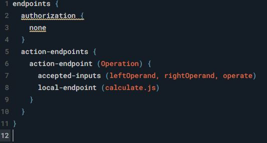

capsule ID는 3가지 (namespace.capsuleName)

* example.캡슐이름 - 예제 캡슐
* playground.캡슐이름 - 배포용 X
* teamname.캡슐이름 - 팀 이름은 따로 등록이 필요(배포하려면 이걸로)


capsule 기본 구조

* code - 비지니스 로직(javaScript 코드)
* models(버그로 인해 직접 만들어야 함) - modeling
* resources - UX/UI, 트레이닝 기능
* capsule.bxb - 모든걸 관리하는 관리 파일


capsule.bxb


* 2 id 는 만든 capsule ID
* 3 version 
* 4 format 확장 프로그램 관련
* 5 targets - 타겟정보 ( 사용기기, 사용언어)
* 6 target은 트레이닝시 영향을 미칩니다.


시나리오 작업 

```
##### playground.calculate utterance #####
7 더하기 8은 얼마야
내가 더하기를 못하는데 3 더하기 2는 얼마니?

발화함수: Operation(Action)
중요한 명명: 7(LeftOperand), 8(RightOperand), 더하기(Operate) => input concept
Results (type: structure) => output concept (저장될 concept: Result)

=====> Modeling
```


Modeling

​	actions

​		

* 5 input - input concept의 별명(파라미터에서 사용)
* 6 type - input concept 에서 사용할 이름
* 7 min & max 
  * min : Optional- 선택적 or Required - 필수적
  * max: One - 한개 or Many - 여러개
* 18 tpye을 정의해 주면 좋다 (4가지 타입이 있다)


​	input concept 생성

​	integer - LeftOperand, RightOperand

​	enum - Operate( 참조 (https://bixbydevelopers.com/dev/docs/reference/type/enum))

​	

​	output concept 생성(structure 타입 으로 하겠다)

​	

integer - Result

text - OperaterName


code - new

action javascript


arg1 부분에 actions에 설정한 별명을 넣어 줍니다


이제 모델과 코드를 연결

resourse에 endpoints



* 6 action-endpoint : action name
* 7 accepted-inputs : 파라미터들
* 8 loacl-endpoint : 자바스크립트 파일


트레이닝

resources 트레이닝 생성


GOAL : 액션 이름 , output concept (보통 output으로 함)


설정 해주자 중요 부분을

